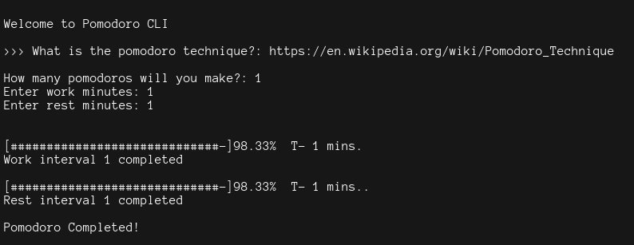
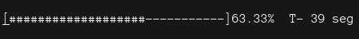
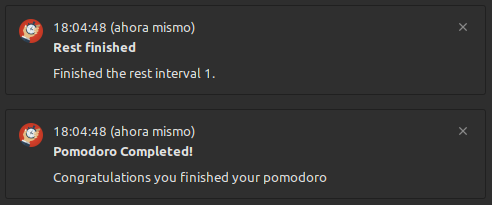
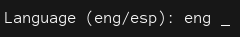

## Pomodoro CLI

This is a simple pomodoro timer for command line interface.
As a small proyect, i wanted to build someting that i can use with _tmux_ and _NeoVim_. To control the time that i'm using for programming, study and rest my eyes of being hours straight in front the monitor. 

**First of all, please install the _plyer_ library for the notifications to work.**

You can use:
> pip install plyer

 or

> python -m pip install plyer

### Pomodoro interface

###The caractheristics in this pomodoro are:

+ Progress bar
+ Shows elapsed time
+ Finish alert within the CLI and a desktop notification
+ Max. time for work and rest of 60 minutes.
+ Repeat the secuence of work/rest many times you like
+ Two languages to choose, english and spanish. By deafault english.

You can change the symbol diplayed for load and the remain in the progress bar. Just change any symbol you like in the next line inside the function _progress_bar_.

>     bar = f"[{'#'*completed}{'-'*missing}]{frac:.2%}"

Using the library _plyer_ the Pomodoro CLI is capable of display desktop notifications. It will use the sound configurations of general notifications.  

Choose your language, english or spanish!

To exit the program use **Ctrl + C**

This is my first proyect upload to GitHub, enjoy it.

